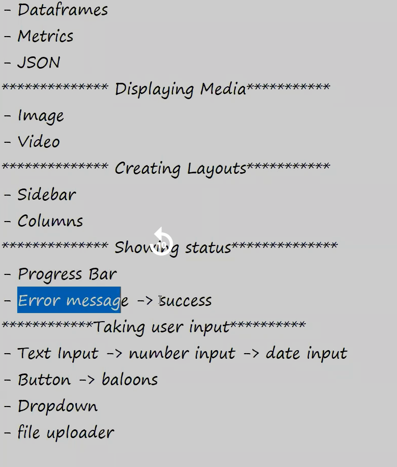

[markdown documentaion ](https://www.markdownguide.org/basic-syntax/#images-1)  
[Steamlit docment ](https://docs.streamlit.io/develop/api-reference)

"""
python -m streamlit run "A:\AIML_DEV_FOLDER\Data visualization_Web_dev\Z_P_Streamlit\startup-dashboard\app.py""
"""

