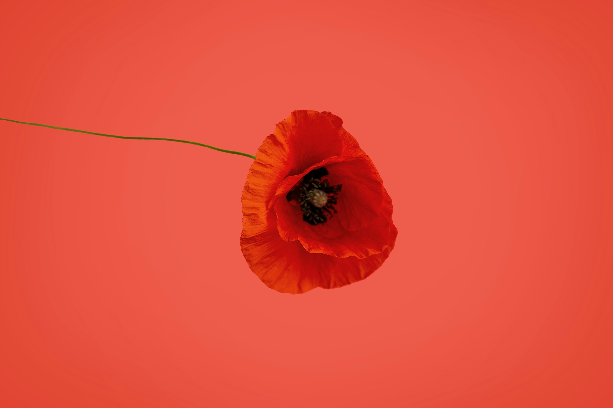

# Markdown Crash Course

https://blog.webdevsimplified.com/2023-06/markdown-crash-course/  
# just add 2 spcaes to change line 
m__ m --> n m (line changed)    
Normal text   
 
just want to change the phargraph you have add a empty line 


////////////////////////////////////////////////////////////
### using "<  p > tags "
<p>
asdasdasd  
asdasd
<p> 
////////////////////////////////////////////////////////////

# Largest heading
## Largest heading
### Largest heading
#### Largest heading

////////////////////////////////////////////////////////////////////
# BOLD text
this is the normal text 
either use ** or __ 


**this is the normal text**  
__this is the normal text__
//////////////////////////////////////////////////////////////////
# Italics text 
just use one  * and _  


Hunting is the human practice of _seeking, pursuing, capturing, and killing wildlife or feral animals_.[10] The most common reasons for humans to hunt are to obtain the animal's body for meat and useful animal products (fur/hide, bone/tusks, horn/antler, etc.), for recreation/taxidermy (see trophy hunting), although it may also be done for resourceful reasons such as removing predators dangerous to humans or domestic animals (e.g. wolf hunting), to eliminate pests and nuisance animals that damage crops/livestock/poultry or spread diseases (see varminting), _for trade/tourism (see safari), or for ecological conservation against overpopulation and invasive species (commonly called a cull).__  
///////////////////////////////////////////////////////
# using crossed off
~~diseases (see varminting)~~  
////////////////////////////////////////////////////////
# super script 
this is super script  
x<sup> 2</sup>


x<sub> 2</sub>


////////////////////////////////////////////////////////////////////  
`this is code `  
``` 
kjashdfkasd
asdasdasd
```
///////////////////////////////////////////////////////
# make a link 


[this is pornhub](https://en.wikipedia.org/wiki/Hunting)  
//////////////////////////////////////////////////////////

# Image 

a. locate your self 
 
 which doesn't worK

B. 
If exist in same folder () 

///////////////////////////////////////////


#Qote 


> this  is the main frame 
>while beign 
nested it 
>>planc b 


/////////////////////////////////////////////////////
oder list  * +
* item 1 
* item 2 
* item 3 
///////////////////////////////////////////////////////

number item 
1. item 3 
1. item 3 
1. item 3 
1. item 3   
/////////
1. item 3
     * tem 
        * la,sknfdln


.////////////////////////////////////////////  

# Table  
 ` 3 dash  atlease and | pipe colmn `
 `    :-- --: align to left and right `


| col 1        | col 2        |
|:----          |-------------: |
| this is it              | this another|
| this is it              | this another|
| this is it              | this another|
| this is it              | this another|
| this is it              | this another|
| this is it              | this another|
| this is it              | this another|

////////////////////////////////////////////////////////

- [ ] sadasdasd
- [x] sadfsdafsad

- [ ] asdasdasd